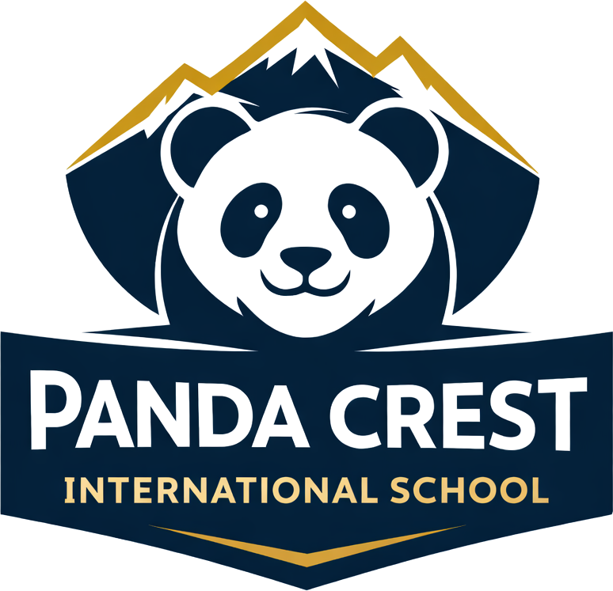
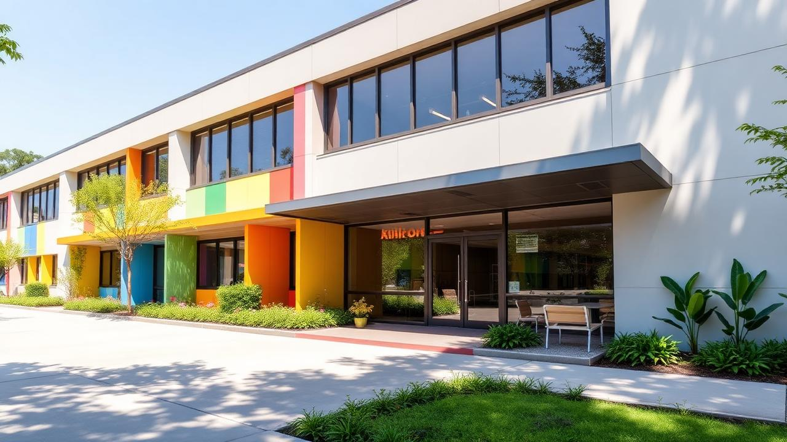

# Panda Crest International School

  

  A premium early-years school website for Panda Crest International School, starting March 2027.

## Overview

This project is the official marketing website for Panda Crest International School. It presents the school's brand identity, curriculum, admissions journey, videos, contact experience, and parent-facing information for families exploring admission from DayCare to UKG.

## Brand Preview

  
  
  

## School Highlights

- Starting March 2027
- Programs from DayCare to UKG
- Blue, white, and orange brand identity
- Premium curriculum cards with popups and visuals
- Admissions workflow with working submenu routes
- Branded videos, parent testimonials, contact form, and floating enquiry CTA
